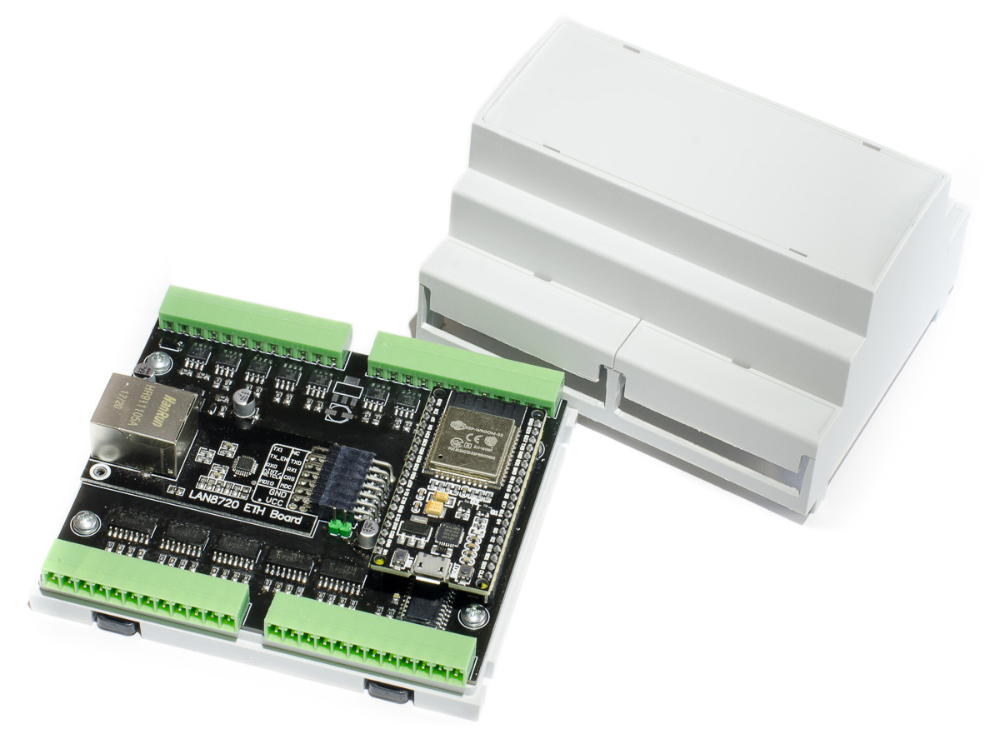
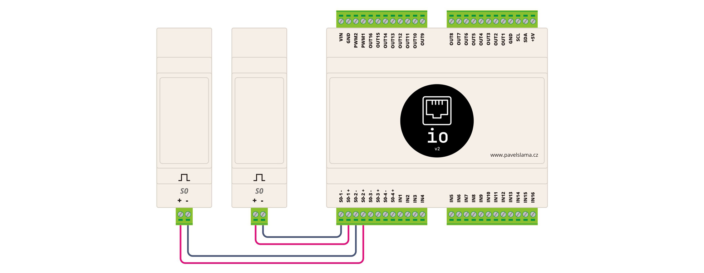

  

# ETH IO
ESP32 based ethernet I/O board for home automation compatible with ESPHome, Tasmota, etc.

**Features**:
- wide range of input voltage 6-28V
- 4x opto-isolated "fast" operation inputs (connected to GPIO)
- 16x opto-isolated general inputs (connected to MCP23017 expander)
- 2x PWM capable low-side fully protected switches (connected to GPIO)
- 16x low-side fully protected switches for switching the non-latching relays or SSR relays (connected to MCP23017 expander)
- daisy chain design - see below

## Basic wiring

## "Fast" inputs
Are meant to be used for reading pulses from utility meter ie. power meter with S0 output

## Daisy chain design
Should you need more inputs/outputs (up to 96 more inputs/outputs or combination thanks to changing the address of MCP23017) you can use the same PCB. Just don't populate ETH breakout board and ESP32 and solder AMS1117-3.3 with its capacitor. The boards will be via SDA/SCL but thanks to a bus buffer (P82B96) communication can easilly be made up to 20 meters!
> In this mode the "slave" device can't use S0 inputs nor the PWM outputs

## Ethernet breakout board "fix"
In order to properly boot the ESP32 you need to "fix" the breakout board - add a wire between spare pin on the header and 50MHz oscillator EN pin. Please see `images` folder.

## BOM
| Qty | Component | Value | Package |
|:---:| --------- | ----- | ------- |
| 2 | Capacitor | 22uF/50V | PANASONIC_C |
| 1 | Capacitor | 100uF/6.3V | PANASONIC_C |
| 4 | Capacitor | 100n | 0805 |
| 4 | 12P PCB plug-in terminal | MC1,5-12-G-3,81 | |
| 2 | Shottky diode | SS16 | DO214AC (SMA) | 
| 1 | Shottky diode | 1N4148WS | SOD323 |
| 1 | Dual shottky diode | BAT54A | SOT23 | 
| 1 | Step-Down Regulator | MCP16301T-I/CH | SOT23-6 |
| 5 | Quad Channel Optocoupler | TLP290-4 | SO16 | 
| 1 | Dual bidirectional bus buffer | P82B96TD | SO08 |
| 2 | IO expander | MCP23017-E/SO | SO28W |
| 1 | Power Coil | SRN5040-220M | L5040 |
| 9 | Smart Low Side Power Switch | BTS3410G | SO8 |
| 3 | Resistor | 680R | 0805 |
| 20 | Resistor | 1K | 0805 |
| 2 | Resistor | 2K2 | 0805 |
| 20 | Resistor | 3K9 | 0805 |
| 2 | Resistor | 4K7 | 0805 |
| 5 | Resistor | 10K 1% | 0805 |
| 1 | Resistor | 52K3 | 0805 |
| 1 | ESP32 breakout board | ESP32_DEVKITV1-38PIN | |
| 1 | Ethernet breakout board | LAN8720_ETH_BOARD | |
| 1 | Right angle 14P connector | WURTH 613014243121 | |
| 1 | 19P header socket | | 19x2.54mm |
| 1 | 17P header socket | | 17x2.54mm |
| 1 | DIN plastic case | ZD1006J ABS V0 | |
| 1 | Top lid for DIN case | ZDFJ1006 ABS V0 | |
| 4 | Screw lid for DIN case | ZD3TCS ABS V0 | |

