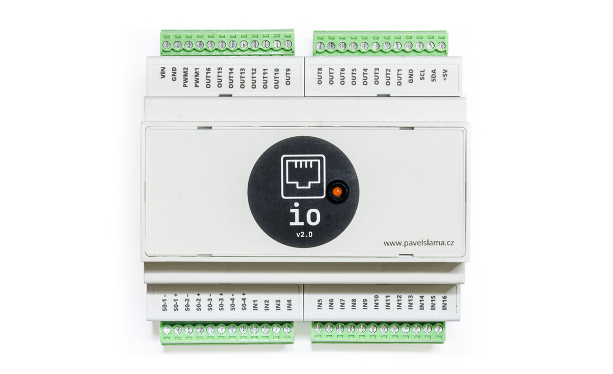
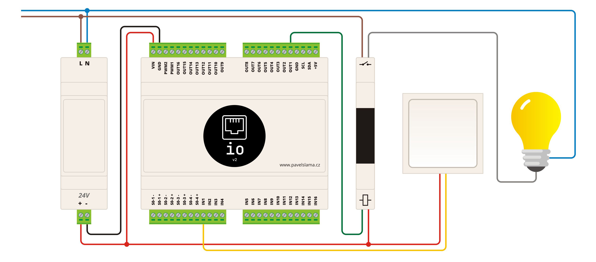
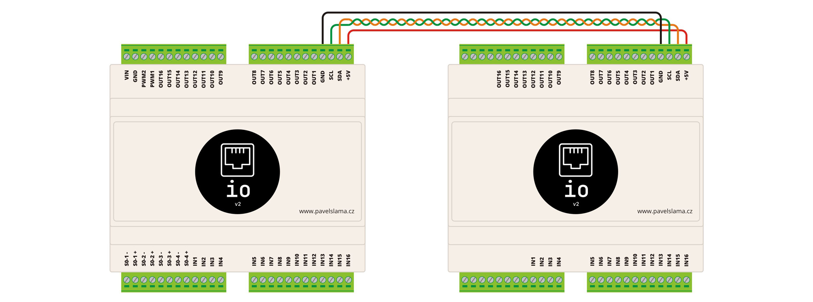

  

# ETH IO
ESP32 based ethernet I/O board for home automation compatible with ESPHome, Tasmota, etc.

**Features**:
- wide range of input voltage 6-28V
- 4x opto-isolated "fast" operation inputs (connected to GPIO)
- 16x opto-isolated general inputs (connected to MCP23017 expander)
- 2x PWM capable low-side fully protected switches (connected to GPIO)
- 16x low-side fully protected switches for switching the non-latching relays or SSR relays (connected to MCP23017 expander)
- daisy chain design - see below

## Basic wiring

## "Fast" inputs
Are meant to be used for reading pulses from utility meter ie. power meter with S0 output

## Daisy chain design
Should you need more inputs/outputs (up to 96 more inputs/outputs or combination thanks to changing the address of MCP23017) you can use the same PCB. Just don't populate ETH breakout board and ESP32 and solder AMS1117-3.3 with its capacitor. The boards will be connected via SDA/SCL but thanks to a bus buffer (P82B96) communication can easilly be made up to 20 meters (possibly more by reducing speed of I2C bus)!
> In this mode the "slave" device can't make use of S0 inputs nor the PWM outputs

_For more information please visit [wiki](./wiki)_